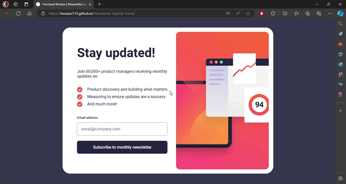

# Frontend Mentor - Newsletter sign-up form with success message solution

<div align="left">
  <a href="https://www.linkedin.com/in/danae-lescano-salvatierra" target="_blank">
    
  </a>
  <a href="https://lescano713.github.io/Newsletter-SignUp-Form/" target="_blank">
    
  </a>
  <a href="https://www.frontendmentor.io/profile/Lescano713" target="_blank">
    
  </a>
</div>


## Table of contents

- [Overview](#overview)
  - [The challenge](#the-challenge)
  - [Screenshot](#screenshot)
- [My process](#my-process)
  - [Built with](#built-with)
  - [What I learned](#what-i-learned)
  - [Continued development](#continued-development)


## Overview

### The challenge

Your users should be able to:

- Add their email and submit the form
- See a success message with their email after successfully submitting the form
- See form validation messages if:
  - The field is left empty
  - The email address is not formatted correctly
- View the optimal layout for the interface depending on their device's screen size
- See hover and focus states for all interactive elements on the page

### Screenshot




## My process

### Built with

- Semantic HTML5 markup
- CSS custom properties
- Flexbox
- mobile-first workflow
- javaScript


### What I learned

<p>I learned how to alternate between states using <b>classList.toggle</b>, <b>classList.add</b>, and <b>classList.remove</b></p>

```css
  .error-state{
    .email-error{
        display: inline;
    }
    input{
        border: 1px solid var(--Tomato);
        color: var(--Tomato);
        background-color: rgba(255, 99, 71, 0.103);
        &::placeholder{
            color: var(--Tomato);
        }
    }
}
```
```js
  form.classList.remove('error-state');
  form.classList.add('error-state');
```

<p>I also implemented media queries and flexbox to convert columns into rows, making the article more responsive on larger screen sizes:</p>


```css
    @media (min-width: 420px) {
    body{
        padding: var(--bodyPadding);
    }
    .success-message{
        border-radius: var(--borderRadius);
        justify-items: center;
        height: 75%;
        width: 90%;
        max-width: 27.5em;;
        padding: 3em 2.5em;
        h1{
            margin-top: 15px;
            font-size: 45px;
        }
    }
}
```

<p>I created a function to change the content of the body when the form is submitted. It takes an email as a parameter and updates the content based on the email provided by the user.</p>

```js
 const messageShow =(email) => {

  //more elements

    const p = document.createElement('p');
    p.innerHTML = `A confirmation email has been sent to <b>${email}</b> . Please open it and click the button inside to confirm your subscription.`;

    divMessage.append(iconSuccess, h1, p);
    headerMessage.append(divMessage, button);
    body.appendChild(headerMessage);

}
```

<p>I used an<b>EventListener</b> to trigger actions when the form is submitted, and I also implemented email validation for the form.</p>

```js
    form.addEventListener('submit', sendForm)
    function sendForm(e){
    e.preventDefault();

    const data = {};
    const fields = e.target.querySelectorAll('input', 'select');
      for (const field of fields) {
          if (!(field.value.includes("@gmail.com")) || field.value == "") {
              form.classList.add('error-state');
              console.log("error");
          }else{
              data[field.name] = field.value;
              form.classList.remove('error-state');
              mainContainer.style.display = 'none';
              messageShow(data[field.name]);
              console.log("success");
          }
      }

    }
```


### Continued development

<p>In future development, I plan to focus on several key areas:</p>
<p>- <strong>Advanced CSS Grid Techniques</strong>: Further exploration of complex grid layouts and the use of <code>grid-template-areas</code> for more flexible and maintainable designs.</p>
<p>- <strong>Responsive Design</strong>: Enhancing responsive layouts using media queries to ensure that web applications look great on all devices.</p>
<p>- <strong>JavaScript Best Practices</strong>: Improving JavaScript code readability and performance by refactoring and leveraging ES6 features like template literals and destructuring.</p>
<p>- <strong>Integrating APIs</strong>: Fetching and displaying data from external APIs to create more dynamic and interactive web applications.</p>
<p>These areas will help me build more sophisticated, user-friendly, and performant web applications.</p>